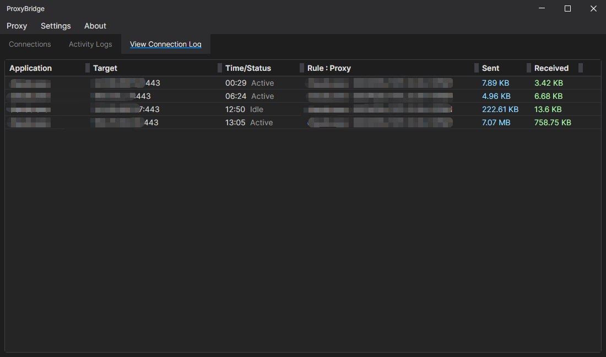
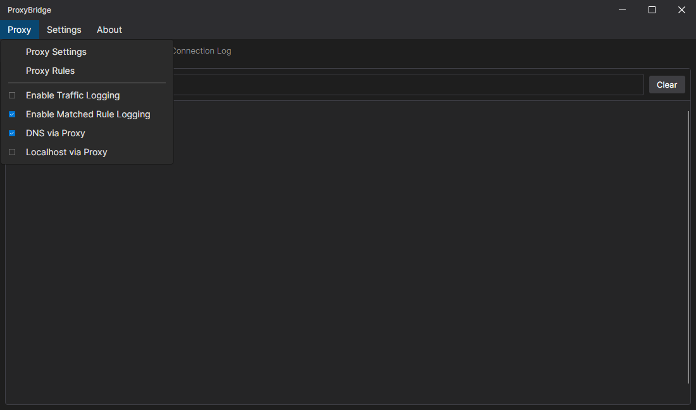
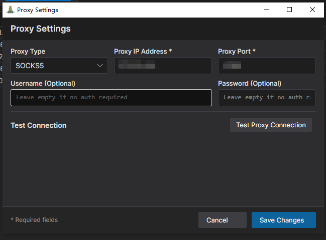

# proxybridge_mod
自用，源码来自proxybridge官方 https://github.com/InterceptSuite/ProxyBridg 

基于ProxyBridge-Setup-3.2.0版本。  

修复：  
1.规则禁用后，自动启动，某些场景禁用无效。  
2.开机启动的处理，去除最小化窗口。  
3.调整"代理设置"窗口。  

增加：  
1.双击托盘出现主窗口。  
2.启用规则匹配日志。  
3.托盘区流量显示。  
4.增加"查看连接日志"功能。  
 
Fixes:  
1.After a rule is disabled, it automatically re-enables; disabling is ineffective in certain scenarios.  
2.Handling of startup launch: removed window minimization.  
3.Adjusted the "Proxy Settings" window.  

Additions:  
1.Double-clicking the system tray icon brings up the main window.  
2.Added rule matching logs.  
3.Traffic display in the system tray area.  
4.Added "View Connection Logs" feature.  

  
 图标流量显示。 
  
  

