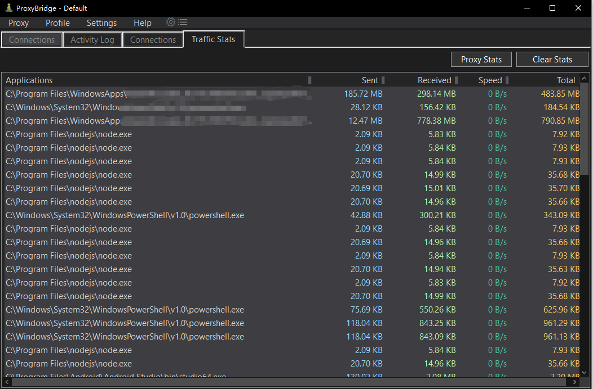
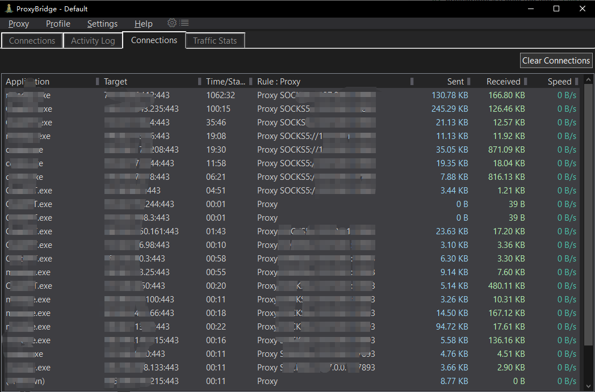
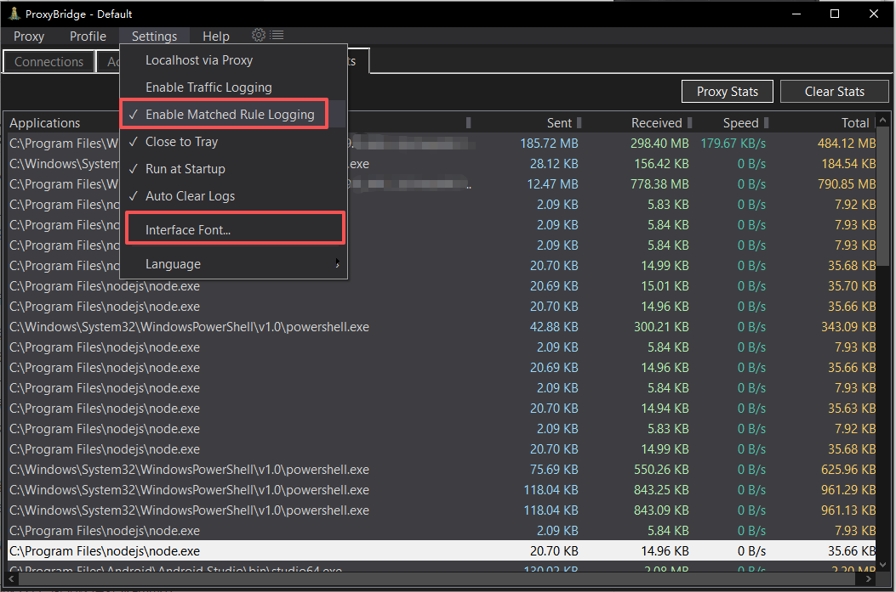
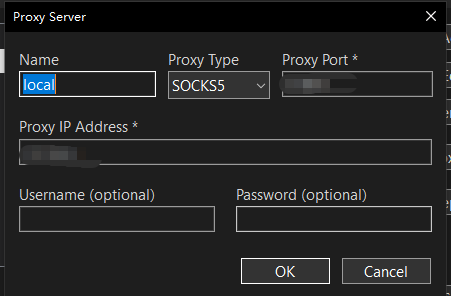
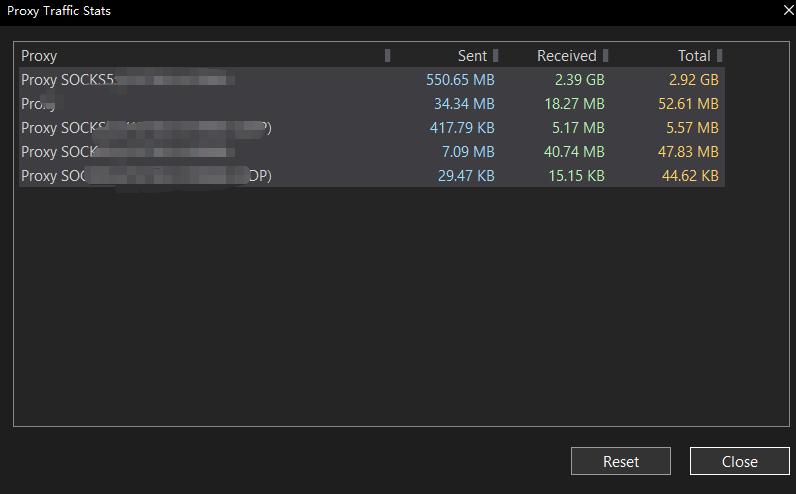
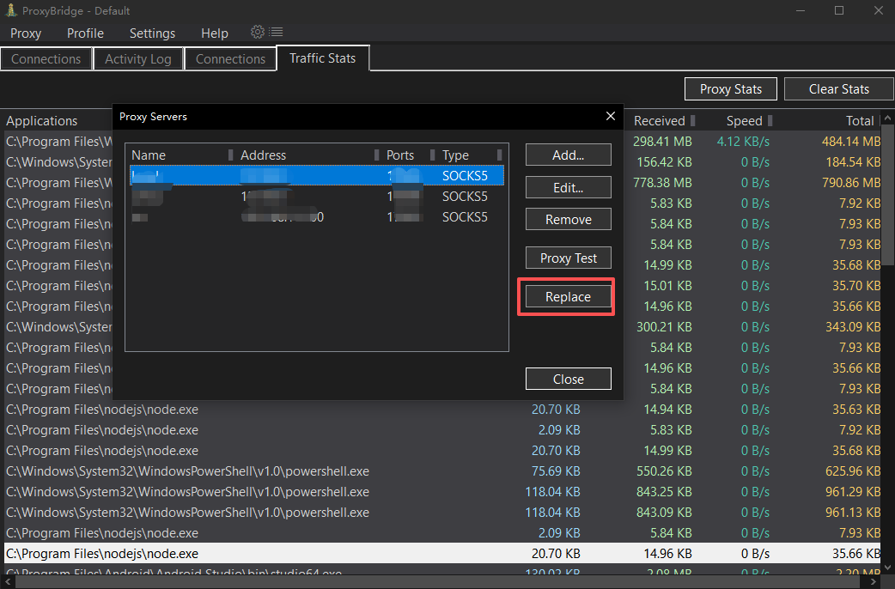
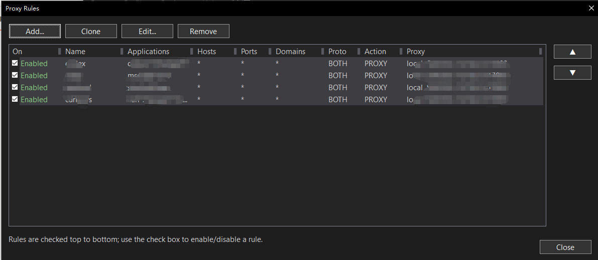
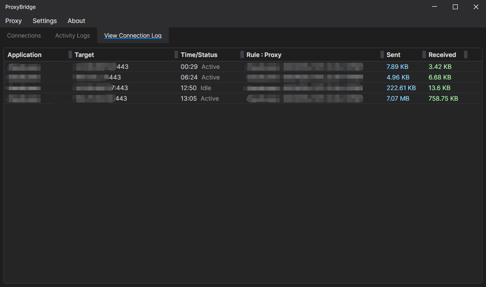
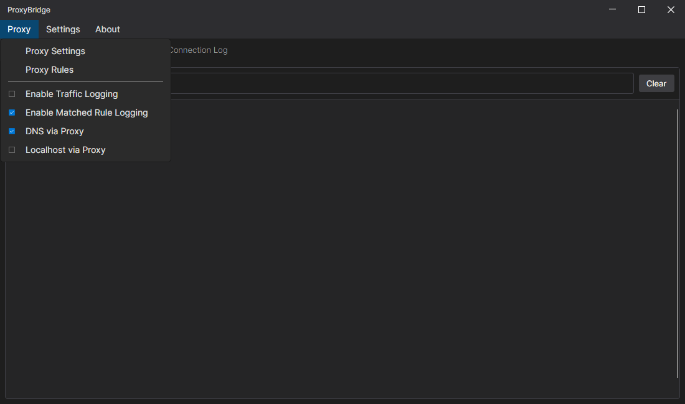
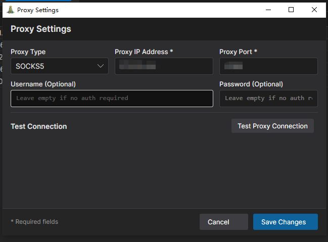

# ProxyBridge Mod

> 基于官方 [ProxyBridge](https://github.com/InterceptSuite/ProxyBridge) 的自定义修改版本（包含 3.2.0 和 4.0Mod）。   by https://soft.54bb.com  
> *A modified version based on official ProxyBridge, offering enhanced GUI, subprocess proxying, loopguard, and bug fixes.*

[RELEASE DOWNLOAD (v4.0 mod last version)](https://github.com/ouoo-code/proxybridge_mod/releases)  
[RELEASE DOWNLOAD (v3.2.0 mod last version)](https://github.com/ouoo-code/proxybridge_mod/releases/tag/mod2)  
---

## 🌟 Mod v4 重大更新 | Mod v4 Major Upgrade (2026-08-08)

### 中文说明
1. **代理子进程支持**：规则内允许配置为代理此规则的程序底下的所有子进程。
   - 优先匹配子进程规则
   - 如未设置子进程规则，则回落到本规则
2. **代理回环保护**：实现子进程代理后，避免程序进程相互调用、代理服务被自我代理导致的死循环。
   - 当触发回环保护时，日志中会显示 `[LOOP GUARD]`
3. **允许代理链开关**：
   - 默认**启用**“代理端点防回环”（即默认关闭“允许代理链”）。
   - 当发现目标等于代理端点时自动切为直连。
   - 仅当明确需要多级代理时，才建议关闭防回环功能。
4. **日志与规则图标说明**：
   | 图标 | 含义 |
   | :---: | :--- |
   | `↯` (闪电) | 子进程代理 (Subprocess Proxy) |
   | `↕` (双箭头) | 父进程代理 (Parent Process Proxy) |

> ⚠️ **测试说明**：当前 Version 4 为测试版本，稳定性尚在验证中，欢迎提交 Issue 反馈问题。

---

### English Version
1. **Implemented Subprocess Proxy Support**: Rules can now be configured to proxy all child processes spawned by the target application.
   - Child process rules take priority.
   - Falls back to the parent process rule if no specific child process rule is defined.
2. **Proxy Loopback Protection**: Prevents infinite loops caused by inter-process calls or self-proxying when subprocess proxying is enabled.
   - When triggered, logs will display `[LOOP GUARD]`.
3. **Added "Allow Proxy Chain" Toggle**:
   - Enabled "Proxy Endpoint Loopback Prevention" by default (i.e., "Allow Proxy Chain" is off).
   - Automatically uses direct connection when the target endpoint equals the proxy endpoint.
   - Disable loopback prevention only when multi-level proxying is explicitly required.
4. **Log & Rule Status Icons**:
   | Icon | Meaning |
   | :---: | :--- |
   | `↯` (Lightning) | Subprocess Proxying |
   | `↕` (Double Arrow) | Parent Process Proxying |

> ⚠️ **Notice**: This v4 release is currently a testing build. Stability may vary—feedback and bug reports are welcome.

---

## 📅 更新日志与修复历史 | Changelog & Bug Fixes

### 2026-07-10 Updates (Mod v4 Base)

#### 中文说明
1. **修复规则错乱**：修复代理删除后，规则引用错乱的问题（已提交 Issue 至官方仓库）。
2. **功能移植**：将原 3.2.0 Mod 中的流量图标、流量统计、查看连接功能、仅显示匹配规则日志等功能全面移植至 4.0。
3. **替换代理功能**：在代理页面新增一键替换功能，可将规则集中所有 `proxy` 类型规则批量替换为当前选中的代理。
4. **界面优化**：重构代理服务器设置界面，沿用并优化了 3.2.0 Mod 的风格。
5. **界面自定义**：支持设置字体类型及字体大小。
6. **源码缺陷修复 (核心网络逻辑)**：
   - 解决连接映射清理与端口决策缓存未同步失效的问题：清理废弃 (stale) 连接时，同步调用 `port_clear(src_port)`。
   - 在 `remove_connection` 时同步清理端口缓存。
   - TCP 映射保留时间从 2 分钟提升至 30 分钟（UDP 仍保持 2 分钟）。
   - 对 TCP/UDP 连接记录增加明确区分，避免误用混淆清理策略。

#### English Version
1. Fixed an issue where deleting a proxy caused rule references to become misaligned (Submitted upstream to official repository).
2. Ported 3.2.0 mod features to 4.0: tray traffic icon, traffic statistics, active connection viewer, and "matched rules only" log filter.
3. Added a **"Replace Proxy"** function on the Proxy page to replace all `proxy` type rules in the current ruleset with the selected proxy at once.
4. Redesigned the proxy server settings window based on the refined 3.2.0 Mod UI.
5. Added custom font and font-size settings.
6. **Core Network & Bug Fixes**:
   - Fixed a desync between connection mapping cleanup and port decision cache invalidation. Added `port_clear(src_port)` during stale connection cleanup.
   - Synchronized port cache clearing inside `remove_connection`.
   - Extended TCP mapping retention time from 2 minutes to 30 minutes (UDP remains at 2 minutes).
   - Separated TCP and UDP connection tracking to prevent policy misapplication across protocols.

---

### 3.2.0 Mod Updates

#### 中文说明
- **修复**：
  1. 修复规则禁用后自动启动、导致某些场景下禁用规则失效的问题。
  2. 优化开机自启行为（去除了默认窗口最小化的限制）。
  3. 调整并美化“代理设置”窗口。
- **新增**：
  1. 支持双击托盘图标快速唤起主窗口。
  2. 增加规则匹配实时日志。
  3. 增加系统托盘实时流量显示。
  4. 新增“查看连接日志”功能。

#### English Version
- **Fixes**:
  1. Fixed an issue where disabled rules were automatically re-enabled under certain scenarios.
  2. Refined startup behavior: removed auto-minimization on launch.
  3. Adjusted layout and styling of the "Proxy Settings" window.
- **Additions**:
  1. Double-clicking the system tray icon now toggles the main window.
  2. Added real-time rule matching logs.
  3. Added live traffic metrics inside the system tray area.
  4. Added a "View Connection Logs" window.

---

## 🖼️ 界面截图 | Screenshots

### v4.0 GUI Mod

| Traffic Status | Connection Logs | Font & Log Settings |
| :---: | :---: | :---: |
|  |  |  |

| Proxy Settings | Proxy Traffic | Replace Proxy |
| :---: | :---: | :---: |
|  |  |  |

| Rules Manager |
| :---: |
|  |

### v3.2.0 GUI Mod

| View Connection Log | Tray Traffic Display |
| :---: | :---: |
|  |  |

| Matched Rule Log | Settings Window |
| :---: | :---: |
|  |  |
